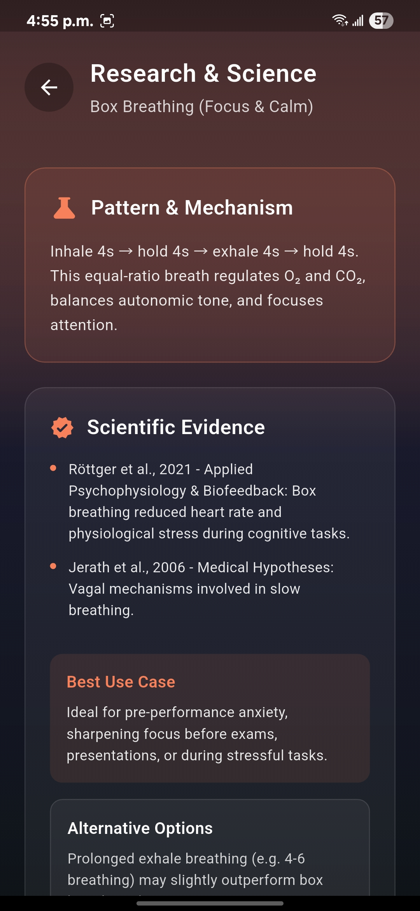
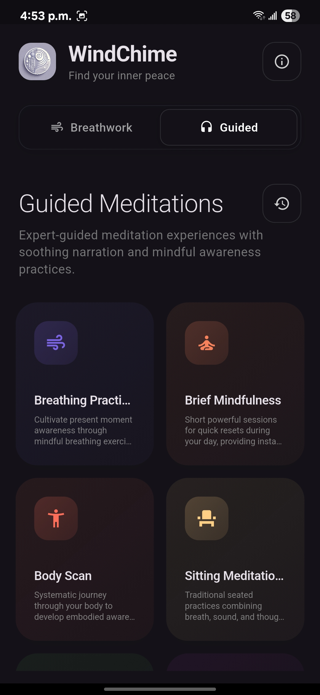
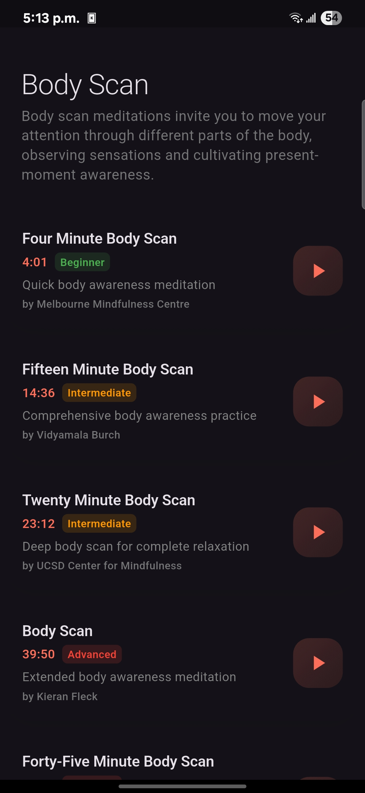
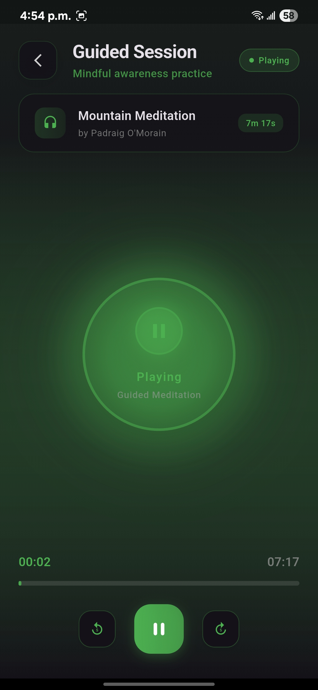
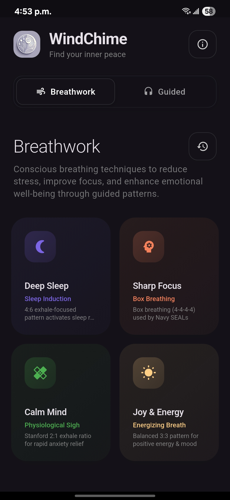
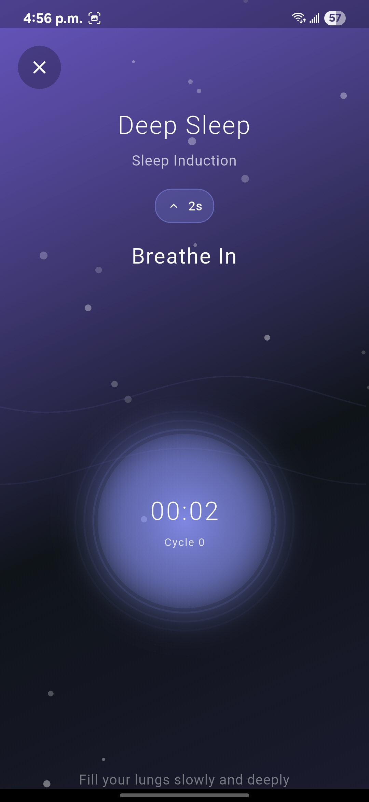
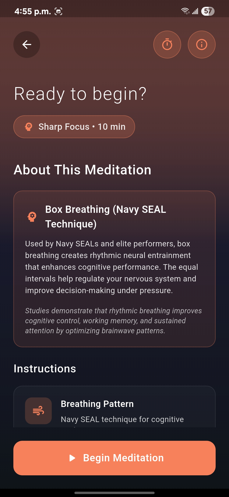
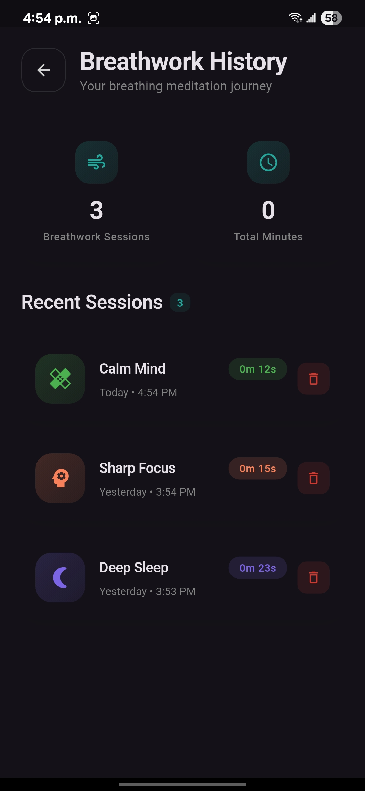
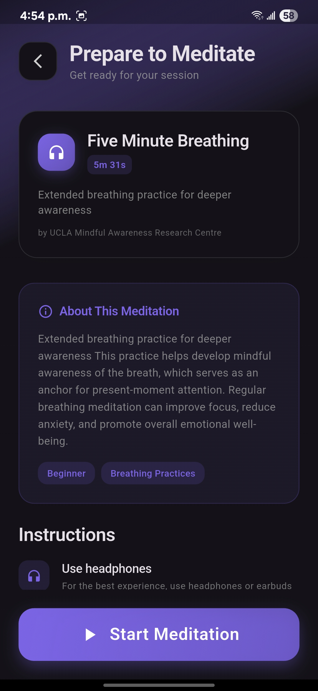

# WindChime 🧘‍♀️

A comprehensive mindfulness app for meditation, sleep, and focus built with Flutter.

## 📱 About

WindChime is a cross-platform mindfulness application designed to help users achieve better mental well-being through guided meditation, breathwork exercises, and mindfulness practices. The app provides a clean and intuitive interface for users to explore various meditation techniques and track their progress.

## ✨ Features

### 🎯 Core Features

- **Guided Meditations**: Extensive library of professionally recorded meditation sessions
- **Breathwork Exercises**: Customizable breathing patterns for anxiety, focus, sleep, and happiness
- **Session History**: Track your meditation journey and progress over time

### 🎵 Meditation Categories

- **Body Scan Meditations**: 4-45 minute guided body scan sessions
- **Breathing Practices**: 3-10 minute focused breathing exercises
- **Brief Mindfulness Practices**: Quick 3-minute sessions for busy schedules
- **Guided Imagery**: Mountain meditations and visualization exercises
- **Self-Guided Sessions**: Bell-only sessions from 5-45 minutes
- **Sitting Meditations**: Traditional mindfulness and wisdom practices

### 🔧 Technical Features

- **Offline Support**: Use meditations without internet connection
- **Local Data Storage**: SQLite database for session history and preferences
- **Audio Management**: High-quality audio playback with background support
- **Haptic Feedback**: Enhanced user experience with tactile responses

## 🚀 Getting Started

### Prerequisites

- Flutter SDK (^3.6.1)
- Dart SDK

### Installation

<!-- //FIXME: Change the github links!!!! -->

1. **Clone the repository**

   ```bash
   git clone https://github.com/yourusername/windchime.git
   cd windchime
   ```

2. **Install dependencies**

   ```bash
   flutter pub get
   ```

3. **Run the app**
   ```bash
   flutter run
   ```

### Building for Production

**Android:**

```bash
flutter build apk --release
# or for app bundle
flutter build appbundle --release
```

**iOS:**
iOS build not implemented yet

**Web:**
Web build not implemented yet

**Desktop:**
Desktop builds not implemented yet

## 🏗️ Architecture

### Project Structure

```
lib/
├── data/                    # Data layer
│   ├── db_helper.dart      # SQLite database helper
│   └── repositories/       # Data repositories
├── models/                 # Data models
│   ├── meditation/         # Meditation-related models
│   ├── home_screen/        # Home screen models
│   └── quote/              # Inspirational quotes
├── providers/              # State management
├── screens/                # UI screens
│   ├── about/              # About page
│   ├── home/               # Home screen
│   ├── meditation/         # Meditation screens
│   └── onboarding/         # User onboarding
├── services/               # Business logic
├── themes/                 # App theming
└── widgets/                # Reusable UI components
```

### Key Dependencies

- **State Management**: Provider pattern
- **Audio Playback**: just_audio, audioplayers
- **Database**: sqflite with cross-platform support
- **Local Storage**: shared_preferences
- **UI Notifications**: flutter_local_notifications
- **Haptic Feedback**: haptic_feedback

## 📸 Screenshots

### Main Features

<div align="center">

#### Research-Based Meditations



#### Guided Meditation Categories



#### Guided Meditation Sessions



</div>

### Meditation Sessions

<div align="center">

#### Guided Meditation Session



#### Breathwork Meditations



#### Breathwork Meditation Session



</div>

### User Experience

<div align="center">

#### Breathwork Tutorial



#### Session History



#### About Screen



</div>

## 📄 License

This project is licensed under the GNU General Public License v3.0 - see the [COPYING](COPYING) file for details.

WindChime is free software: you can redistribute it and/or modify it under the terms of the GNU General Public License as published by the Free Software Foundation, either version 3 of the License, or (at your option) any later version.

This program is distributed in the hope that it will be useful, but WITHOUT ANY WARRANTY; without even the implied warranty of MERCHANTABILITY or FITNESS FOR A PARTICULAR PURPOSE. See the GNU General Public License for more details.

## 🙏 Acknowledgments

- [FreeMindfullness.org](https://www.freemindfulness.org/) for Guided Meditaions
- [Open Game Art](https://opengameart.org/) and [Pixabay](https://pixabay.com/sound-effects/) Creators for Sound Effects

## 📞 Support

For support, feedback, or questions:

- Open an issue on GitHub

## 🔮 Roadmap

- [ ] User Accounts for Data Migrations and Backups
- [ ] Better Insights into session histories
- [ ] Push Notifications

---

**Made with ❤️ and mindfulness**

_Version 0.1.0_
