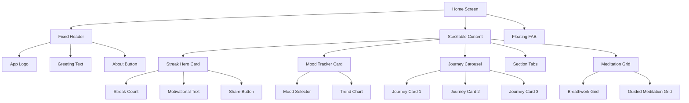

# WindChime Home Screen - Detailed UI Specifications

## Visual Design Specifications

### Layout Hierarchy



## Component Specifications

### 1. Streak Hero Card

**Dimensions**:

- Height: 140px
- Margin: 16px horizontal, 8px top
- Border radius: 24px
- Elevation: 8dp

**Visual Elements**:

```
┌────────────────────────────────────┐
│  🔥                          [📤]  │
│  5 Day Streak!                     │
│  ━━━━━━━━━━ 70%                    │
│  Keep it going! Only 3 days to     │
│  earn the "Week Warrior" badge     │
└────────────────────────────────────┘
```

**Style**:

- Background: Linear gradient (primary color 0.15 → 0.05 opacity)
- Fire emoji: 48px size, animated flicker
- Streak number: 36px bold, primary color
- Progress bar: 4px height, rounded, gradient fill
- Text: 14px regular, secondary text color
- Share icon: 20px, top-right corner, transparent button

**States**:

- Default: Subtle pulsing animation
- Milestone (7, 30, 100 days): Confetti animation
- Broken streak: Gray with encouraging message

---

### 2. Mood Tracker Card

**Dimensions**:

- Height: Auto (min 180px)
- Margin: 16px horizontal, 12px vertical
- Border radius: 20px
- Elevation: 4dp

**Visual Elements**:

```
┌────────────────────────────────────┐
│  How are you feeling today?        │
│  😊  😌  😰  😴  😐                 │
│  ┌──────────────────────────────┐  │
│  │     Mood Trend (7 days)      │  │
│  │  ╱╲    ╱╲                    │  │
│  │ ╱  ╲  ╱  ╲╱                  │  │
│  └──────────────────────────────┘  │
│  Mon  Tue  Wed  Thu  Fri  Sat  Sun │
└────────────────────────────────────┘
```

**Style**:

- Background: Surface color with 0.6 opacity
- Title: 16px semibold
- Emojis: 36px, with 12px spacing
- Selected emoji: 44px, elevated, subtle glow
- Chart: Line chart with gradient fill
- Chart colors: Mood-based gradient (happy=yellow, calm=blue, etc.)
- Chart height: 80px

**Interactions**:

- Tap emoji: Scale up, haptic feedback, save mood
- Tap chart: Navigate to detailed mood analytics
- Swipe chart: View different time ranges

---

### 3. Journey Carousel

**Dimensions**:

- Height: 160px
- Margin: 16px horizontal, 8px vertical
- Card width: 280px (with 16px spacing)
- Border radius: 20px

**Visual Elements**:

```
┌──────────────────────────┐  ┌───────────
│  [Journey Image]         │  │  [Journey
│                          │  │
│  7-Day Sleep Reset       │  │  Stress R
│  Day 3/7  ●●●○○○○        │  │  Day 1/14
│                          │  │
│  [Continue →]            │  │  [Start →
└──────────────────────────┘  └───────────
```

**Style**:

- Background: Gradient overlay on image
- Image: 120px height, top-aligned
- Title: 18px bold, white with shadow
- Progress: Circular dots, filled = completed
- Button: Outlined, white border, 14px text
- Card shadow: Elevation 6dp

**Journey Card Types**:

1. **Active Journey**: Progress indicator, "Continue" button
2. **New Journey**: Lock icon, "Start" button
3. **Completed Journey**: Checkmark badge, "Review" button

**Animations**:

- Snap scrolling between cards
- Parallax effect on background image
- Progress dots fill animation

---

### 4. Quick Session FAB

**Dimensions**:

- Size: 64x64px
- Position: Bottom-right, 16px from edges
- Elevation: 12dp

**Visual Elements**:

```
    ●
   ◐ ◑
    ●
  [▶️]
```

**Style**:

- Background: Radial gradient (primary color)
- Icon: Play icon, 28px, white
- Glow: 8px blur, primary color 0.3 opacity
- Pulsing ring: Animated, 2s duration

**States**:

- **Idle**: Gentle pulsing glow
- **Pressed**: Scale to 0.95, darker gradient
- **Loading**: Circular progress indicator
- **Long Press**: Expands to show quick menu

**Quick Menu (Long Press)**:

```
┌─────────────────────┐
│  🌙 Sleep (10 min)  │
│  🎯 Focus (5 min)   │
│  😌 Calm (8 min)    │
│  ⚡ Energy (3 min)  │
└─────────────────────┘
```

---

### 5. Enhanced Meditation Cards

**Updates to Existing Cards**:

**Top-Right Corner Addition**:

```
┌────────────────────┐
│              [🔊]  │  ← Sound icon (20px)
│                    │
│   [Icon]           │
│                    │
│                    │
│   Title            │
│   Subtitle         │
│   Description      │
└────────────────────┘
```

**Bottom-Left Addition**:

```
└────────────────────┘
  ★  Last: 2h ago     ← Favorite + last played
```

**Sound Mixer Sheet**:
When sound icon tapped, bottom sheet appears:

```
┌────────────────────────────────────┐
│  Ambient Sounds                    │
├────────────────────────────────────┤
│  🌊 Ocean Waves        [━━━○○] 60% │
│  🌧️ Rain               [━━○○○] 40% │
│  🌲 Forest Birds       [━○○○○] 20% │
│  🔥 Crackling Fire     [○○○○○]  0% │
│  🎵 Singing Bowl       [━━━━○] 80% │
├────────────────────────────────────┤
│           [Save Preset]            │
└────────────────────────────────────┘
```

---

## Section Tabs Enhancement

**Current Design** (maintain):

- Two tabs: Breathwork | Guided Meditation
- Segmented control style
- Smooth transition animation

**Visual Update**:

```
┌─────────────────────────────────────┐
│  ╔═══════════╗  ┌───────────┐      │
│  ║ Breathwork║  │  Guided   │      │
│  ╚═══════════╝  └───────────┘      │
└─────────────────────────────────────┘
```

Active tab: Filled background, bold text, icon animation
Inactive tab: Transparent, regular text, static icon

---

## Color Palette (Light & Dark Mode)

### Streak Card

- **Light**:
  - Background: Linear gradient from primary color (0.15 opacity) to (0.05 opacity)
  - Text: Gray 900
  - Fire: Orange gradient (#FF6B35 → #F7931E)
- **Dark**:
  - Background: Linear gradient from primary color (0.2 opacity) to (0.08 opacity)
  - Text: Gray 100
  - Fire: Brighter orange (#FF8C42 → #FFA726)

### Mood Emojis Color Mapping

- 😊 Happy: #FFD700 (Gold)
- 😌 Calm: #4A90E2 (Blue)
- 😰 Anxious: #9B59B6 (Purple)
- 😴 Tired: #95A5A6 (Gray)
- 😐 Neutral: #7F8C8D (Slate)

### Journey Cards

- Progress completed: #00C853 (Green)
- Progress incomplete: Surface color (0.3 opacity)
- Locked journey: Gray 400

---

## Spacing & Typography

### Spacing System

- **XXS**: 4px
- **XS**: 8px
- **S**: 12px
- **M**: 16px
- **L**: 24px
- **XL**: 32px
- **XXL**: 48px

### Typography Scale

- **Display**: 36px, Bold (Streak number)
- **H1**: 24px, Bold (Section headers)
- **H2**: 20px, Semibold (Card titles)
- **H3**: 18px, Semibold (Journey titles)
- **Body**: 14px, Regular (Descriptions)
- **Caption**: 12px, Regular (Metadata)
- **Label**: 11px, Medium (Buttons)

---

## Animations Specifications

### 1. Streak Card Flame

```dart
Animation: Flicker
Duration: 1.5s
Curve: Ease in-out
Transform: Scale 0.95 to 1.05, Rotate -5° to 5°
Loop: Infinite
```

### 2. FAB Pulse

```dart
Animation: Radial pulse
Duration: 2s
Curve: Ease out
Transform: Glow opacity 0.3 to 0.6, Scale 1.0 to 1.15
Loop: Infinite
Delay: Starts after 3s of inactivity
```

### 3. Mood Selection

```dart
Animation: Bounce + Haptic
Duration: 300ms
Curve: Elastic out
Transform: Scale 1.0 to 1.2 to 1.1
Haptic: Medium impact
```

### 4. Journey Carousel

```dart
Animation: Snap scroll with parallax
Duration: 400ms
Curve: Ease out cubic
Transform: Background image slides at 0.5x speed
```

### 5. Card Appearance (Stagger)

```dart
Animation: Fade + Slide up
Duration: 600ms
Curve: Ease out
Transform: Opacity 0 to 1, TranslateY 20 to 0
Delay: 100ms between each card
```

---

## Accessibility Features

### Screen Reader Support

- Streak card: "Current meditation streak: 5 days. Share your progress"
- Mood buttons: "Select happy mood", "Select calm mood", etc.
- Journey cards: "Sleep reset journey, day 3 of 7, continue"
- FAB: "Quick start meditation session"

### High Contrast Mode

- Increase border width from 1px to 2px
- Enhance color contrast ratios to WCAG AAA
- Remove subtle gradients, use solid colors

### Large Text Support

- All text scales with system font size
- Minimum touch target: 44x44px
- Flexible layouts that reflow

### Keyboard Navigation

- Tab order: Header → Streak → Mood → Journeys → Tabs → Grid → FAB
- Enter key activates focused element
- Arrow keys navigate within sections

---

## Responsive Breakpoints

### Small (< 360px width)

- Single column layout
- Journey cards: Full width minus padding
- Meditation grid: 1 column

### Medium (360px - 600px)

- Current design
- Journey cards: Scrollable horizontal
- Meditation grid: 2 columns

### Large (> 600px)

- Journey cards: 3 visible at once
- Meditation grid: 3-4 columns
- Wider cards with more padding

---

## Implementation Priority

### Phase 1 (MVP - This Sprint)

1. ✅ Streak card UI (placeholder data)
2. ✅ Mood selector UI (non-functional)
3. ✅ Journey carousel UI (sample journeys)
4. ✅ Quick Session FAB
5. ✅ Enhanced meditation cards with sound icon

### Phase 2 (Backend Integration)

1. Database schema for mood/streaks
2. Actual mood tracking logic
3. Streak calculation service
4. Journey progress system

### Phase 3 (Advanced Features)

1. Sound mixer functionality
2. Social sharing
3. Analytics dashboard
4. Journey customization

---

This specification provides a complete visual blueprint for the redesigned home screen. All measurements, colors, and animations are precisely defined for consistent implementation.
